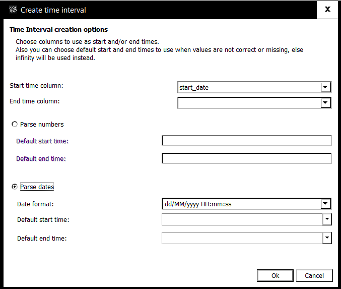

twarc
=====

[](http://travis-ci.org/DocNow/twarc)

*翻译: [英语], [日语], [葡萄牙语], [西班牙语], [斯瓦希里语], [瑞典语]*

twarc 是一个用来存档推特 JSON 数据的命令行工具和 Python 包。

twarc 处理的每一条推文都用一个 JSON 对象来表示，[正如]((https://dev.twitter.com/overview/api/tweets))推特 API 返回的一样。twarc 会自动处理推特 API 的[流量限制](https://dev.twitter.com/rest/public/rate-limiting)。除了可以让你收集推文之外，twarc 还可以帮助你收集用户、当下流行和获得推文 id 的详细信息。

twarc 是作为 [Mellon Foundation](https://mellon.org/) 资助下的 [Documenting the Now](http://www.docnow.io) 项目的一部分开发的。

## 安装

在使用 twarc 之前，你需要在 [apps.twitter.com](http://apps.twitter.com) 注册一个应用。一旦你注册了你的应用，记下你的 consumer key 和 consumer secret 并点击生成一组 access token 和 access token secret. 这四个数据在手你就可以开始使用 twarc 了。

1. 安装 [Python](http://python.org/download) (2 或者 3)
2. [pip](https://pip.pypa.io/en/stable/installing/) install twarc

### Homebrew (仅限macOS 系统)

macOS系统用户, 你可以通过Homebrew安装 `twarc` :

```shell
$ brew install twarc
```

## 快速开始:

首先你需要告诉 twarc 你的应用 keys 并授权它访问一个或者多个推特账号：

```shell
twarc configure
```

然后尝试搜索

```shell
twarc search blacklivesmatter > search.jsonl
```

或者你想试试实时搜索?

```shell
twarc filter blacklivesmatter > stream.jsonl
```

请阅读下文了解更多这些命令的意义和更多内容。

## 使用

### 配置

在获得应用 keys 之后你可以通过 `configure` 命令来告诉 twarc 它们的值。

```shell
twarc configure
```

这样做会在你的 `~` 目录下创建一个名为 `.twarc` 的文件来储存你的这些凭证，这样你就不必每次使用 twarc 的时候输入它们。如果你倾向于每次使用 twarc 的时候输入 keys，你可以使用环境变量 (`CONSUMER_KEY`,
`CONSUMER_SECRET`, `ACCESS_TOKEN`, `ACCESS_TOKEN_SECRET`) 或者使用命令行工具选项 (`--consumer_key`, `--consumer_secret`, `--access_token`,
`--access_token_secret`).

### 搜索

搜索功能使用推特的[搜索推文](https://dev.twitter.com/rest/reference/get/search/tweets)来下载*已经存在*的符合搜索字符串的推文。

```shell
twarc search blacklivesmatter > tweets.jsonl
```

It's important to note that `search` will return tweets that are found within a
7 day window that Twitter's search API imposes. If this seems like a small
window, it is, but you may be interested in collecting tweets as they happen
using the `filter` and `sample` commands below.

尤其需要注意的是 `search` 返回的是过去七天内的推文：这是推特搜索 API 的限制。如果你觉得这太短了——我们也觉得。你或许会更愿意尝试使用下文提到的 `filter` 和 `sample` 命令。

The best way to get familiar with Twitter's search syntax is to experiment with
[Twitter's Advanced Search](https://twitter.com/search-advanced) and copy and
pasting the resulting query from the search box. For example here is a more
complicated query that searches for tweets containing either the
\#blacklivesmatter or #blm hashtags that were sent to deray.

最好的快速上手推特搜索语法的方法是实验[推特高级搜索](https://twitter.com/search-advanced)的内容，复制粘贴搜索框里的查询语句。比如这里有一个比较复杂的查询语句，它搜索包含有 `#blacklivesmatter` 和 `#blm` 并发给 [deray](https://twitter.com/deray) 的推文。

```shell
twarc search '#blacklivesmatter OR #blm to:deray' > tweets.jsonl
```

你还应当看一看 Igor Brigadir 关于推特高级搜索语法`精彩绝伦`的指南: [推特高级搜索 (英文)](https://github.com/igorbrigadir/twitter-advanced-search/blob/master/README.md). 这份指南里包含了很多阅读推特搜索文档后依然不显然的玄妙之处。

推特尝试显式地定义推文的语言。你可以尝试限制你获得的推文的语言如果你想使用 [ISO 639-1] 规范的话。

```shell
twarc search '#blacklivesmatter' --lang fr > tweets.jsonl
```

你还可以通过位置来搜索，比如搜索包含 `#blacklivesmatter` 且位置定位在密苏里弗格森半径1英里之内的推文。

```shell
twarc search blacklivesmatter --geocode 38.7442,-90.3054,1mi > tweets.jsonl
```

If a search query isn't supplied when using `--geocode` you will get all tweets
relevant for that location and radius:

如果一个包含 `--geocode` 的搜索没有包含要查询的字符串，那么你将得到所有与该位置和其半径相关的推文。

```shell
twarc search --geocode 38.7442,-90.3054,1mi > tweets.jsonl
```

### 过滤

`filter` 命令使用推特的 [状态/过滤](https://dev.twitter.com/streaming/reference/post/statuses/filter) API 来搜集实时推文。

```shell
twarc filter blacklivesmatter,blm > tweets.jsonl
```

Please note that the syntax for the Twitter's track queries is slightly
different than what queries in their search API. So please consult the
documentation on how best to express the filter option you are using.

请注意推特的 `track` 查询语句的语法和搜索 API 里的语法略有不同。请使用官方文档来了解如何最好地表达你的过滤命令选项。

使用 `follow` 命令行参数和用户的 id 来实时收集某个具体用户的推文。这个命令的结果包含转推。举个例子，下面的命令搜索 `CNN` 的推文和转推。

```shell
twarc filter --follow 759251 > tweets.jsonl
```

你还可以限制一个地理上的矩形边界来收集推文。注意经纬度数据中的短横线必须用`\`转义，否则它将被理解成一个命令行参数！

```shell
twarc filter --locations "\-74,40,-73,41" > tweets.jsonl
```

You can use the `lang` command line argument to pass in a [ISO 639-1] language
code to limit to, and since the filter stream allow you to filter by one more
languages it is repeatable. So this would collect tweets that mention paris or
madrid that were made in French or Spanish:

你还可以使用 `lang` 命令行参数来传入 [ISO 639-1] 语言代码来限制语言。你还可以多次使用这个参数限制多种语言。下面的例子实时收集提到了巴黎和马德里的法语推文和西班牙语推文。

```shell
twarc filter paris,madrid --lang fr --lang es
```

`filter` 和 `follow` 命令是**或**关系。下面的例子将收集包含 `blacklivesmatter` 或者 `blm` 的推文，或者是来自 CNN 的推文。

```shell
twarc filter blacklivesmatter,blm --follow 759251 > tweets.jsonl
```

但是将位置和语言限制合并将得到**和**的关系，下面的例子收集来自纽约的法语或者西班牙语推文。

```shell
twarc filter --locations "\-74,40,-73,41" --lang es --lang fr
```

### 采样

使用 `sample` 命令来监听推特的 [状态/采样](https://dev.twitter.com/streaming/reference/get/statuses/sample) API 来“随机“采样最近的公开的推文。

```shell
twarc sample > tweets.jsonl
```

### `脱水`

所谓的脱水 `dehydrate` 命令读取一个推文的 jsonl 文件，生成一个包含推文 id 的列表。

```shell
twarc dehydrate tweets.jsonl > tweet-ids.txt
```

### `补水`

twarc 所谓的补水命令 `hydrate` 是 `dehydrate` 的反过程，它读取一个包含推文 id 的文件，使用推特的 [状态/检索](https://dev.twitter.com/rest/reference/get/statuses/lookup) API 重建完整的包含完整推文 json 的 jsonl 文件。

```shell
twarc hydrate ids.txt > tweets.jsonl
```

推特 API 的[服务条款](https://dev.twitter.com/overview/terms/policy#6._Be_a_Good_Partner_to_Twitter) 反对用户将大量原始推文数据公布在网络上。数据可以被用来研究使用和保存在本地，但是不可以和世界分享。推特确实允许用户大量地将推文 id 公开分享，而这些 id 可以用来重建推文 JSON 数据——通过 `hydrate` 命令和推特的 API. 这一点对于社交媒体研究中的[复现](https://en.wikipedia.org/wiki/Reproducibility)尤为重要。

### 用户

用户 `users` 命令可以返回（多个）用户的元数据。用户的名称由推特上的屏幕名称唯一确认。

```shell
twarc users deray,Nettaaaaaaaa > users.jsonl
```

你也可以使用用户的 id.

```shell
twarc users 1232134,1413213 > users.jsonl
```

你也可以使用一个包含用户 id 的文件作为输入，这在你同时使用 `followers` 和 `friends` 命令时尤其有用。举例如下：

```shell
twarc users ids.txt > users.jsonl
```

### 粉丝

粉丝 `followers` 命令使用推特的 [粉丝 id](https://dev.twitter.com/rest/reference/get/followers/ids) API 来收集推特用户粉丝的 id 信息。该命令的输入只能是一个用户的屏幕名称。举例如下：

```shell
twarc followers deray > follower_ids.txt
```

输出的结果每一行是一个粉丝用户 id. 最新的粉丝将出现在最前面，依时间顺序倒序排列。

### 朋友

和粉丝 `followers` 命令类似，朋友 `friends` 命令将使用推特的 [朋友 id](https://dev.twitter.com/rest/reference/get/friends/ids) API 收集推特用户朋友的 id 信息。该命令的输入只能是一个用户的屏幕名称。举例如下：

```shell
twarc friends deray > friend_ids.txt
```

### 当下流行

The `trends` command lets you retrieve information from Twitter's API about trending hashtags. You need to supply a [Where On Earth](https://web.archive.org/web/20180102203025/https://developer.yahoo.com/geo/geoplanet/) identifier (`woeid`) to indicate what trends you are interested in. For example here's how you can get the current trends for St Louis:

    twarc trends 2486982

Using a `woeid` of 1 will return trends for the entire planet:

    twarc trends 1

If you aren't sure what to use as a `woeid` just omit it and you will get a list
of all the places for which Twitter tracks trends:

    twarc trends

If you have a geo-location you can use it instead of the `woedid`.

    twarc trends 39.9062,-79.4679

Behind the scenes twarc will lookup the location using Twitter's [trends/closest](https://dev.twitter.com/rest/reference/get/trends/closest) API to find the nearest `woeid`.

### Timeline

The `timeline` command will use Twitter's [user timeline API](https://dev.twitter.com/rest/reference/get/statuses/user_timeline) to collect the most recent tweets posted by the user indicated by screen_name.

    twarc timeline deray > tweets.jsonl

You can also look up users using a user id:

    twarc timeline 12345 > tweets.jsonl

### Retweets

You can get retweets for a given tweet id like so:

    twarc retweets 824077910927691778 > retweets.jsonl

If you have tweet_ids that you would like to fetch the retweets for, you can:

    twarc retweets ids.txt > retweets.jsonl

### Replies

Unfortunately Twitter's API does not currently support getting replies to a
tweet. So twarc approximates it by using the search API. Since the search API
does not support getting tweets older than a week, twarc can only get the
replies to a tweet that have been sent in the last week.

If you want to get the replies to a given tweet you can:

    twarc replies 824077910927691778 > replies.jsonl

Using the `--recursive` option will also fetch replies to the replies as well as
quotes.  This can take a long time to complete for a large thread because of
rate limiting by the search API.

    twarc replies 824077910927691778 --recursive

### Lists

To get the users that are on a list you can use the list URL with the
`listmembers` command:

    twarc listmembers https://twitter.com/edsu/lists/bots

## Premium Search API

Twitter introduced a Premium Search API that lets you pay Twitter money for tweets.
Once you have set up an environment in your
[dashboard](https://developer.twitter.com/en/dashboard) you can use their 30day
and fullarchive endpoints to search for tweets outside the 7 day window provided
by the Standard Search API. To use the premium API from the command line you
will need to indicate which endpoint you are using, and the environment.

To avoid using up your entire budget you will likely want to limit the time
range using `--to_date` and `--from_date`. Additionally you can limit the
maximum number of tweets returned using `--limit`.

So for example, if I wanted to get all the blacklivesmatter tweets from a two
weeks ago (assuming today is June 1, 2020) using my environment named
*docnowdev* but not retrieving more than 1000 tweets, I could:

    twarc search blacklivesmatter \
      --30day docnowdev \
      --from_date 2020-05-01 \
      --to_date 2020-05-14 \
      --limit 1000 \
      > tweets.jsonl

Similarly, to find tweets from 2014 using the full archive you can:

    twarc search blacklivesmatter \
      --fullarchive docnowdev \
      --from_date 2014-08-04 \
      --to_date 2014-08-05 \
      --limit 1000 \
      > tweets.jsonl

If your environment is sandboxed you will need to use `--sandbox` so that twarc
knows not to request more than 100 tweets at a time (the default for
non-sandboxed environments is 500)

    twarc search blacklivesmatter \
      --fullarchive docnowdev \
      --from_date 2014-08-04 \
      --to_date 2014-08-05 \
      --limit 1000 \
      --sandbox \
      > tweets.jsonl

## Gnip Enterprise API

Twarc supports integration with the Gnip Twitter Full-Archive Enterprise API.
To do so, you must pass in the `--gnip_auth` argument. Additionally, set the
`GNIP_USERNAME`, `GNIP_PASSWORD`, and `GNIP_ACCOUNT` environment variables.
You can then run the following:

    twarc search blacklivesmatter \
      --gnip_auth \
      --gnip_fullarchive prod \
      --from_date 2014-08-04 \
      --to_date 2015-08-05 \
      --limit 1000 \
      > tweets.jsonl

## Use as a Library

If you want you can use twarc programmatically as a library to collect
tweets. You first need to create a `Twarc` instance (using your Twitter
credentials), and then use it to iterate through search results, filter
results or lookup results.

```python
from twarc import Twarc

t = Twarc(consumer_key, consumer_secret, access_token, access_token_secret)
for tweet in t.search("ferguson"):
    print(tweet["text"])
```

You can do the same for a filter stream of new tweets that match a track
keyword

```python
for tweet in t.filter(track="ferguson"):
    print(tweet["text"])
```

or location:

```python
for tweet in t.filter(locations="-74,40,-73,41"):
    print(tweet["text"])
```

or user ids:

```python
for tweet in t.filter(follow='12345,678910'):
    print(tweet["text"])
```

Similarly you can hydrate tweet identifiers by passing in a list of ids
or a generator:

```python
for tweet in t.hydrate(open('ids.txt')):
    print(tweet["text"])
```

## User vs App Auth

Twarc will manage rate limiting by Twitter. However, you should know that
their rate limiting varies based on the way that you authenticate. The two
options are User Auth and App Auth. Twarc defaults to using User Auth but you
can tell it to use App Auth.

Switching to App Auth can be handy in some situations like when you are
searching tweets, since User Auth can only issue 180 requests every 15 minutes
(1.6 million tweets per day), but App Auth can issue 450 (4.3 million tweets per
day).

But be careful: the `statuses/lookup` endpoint used by the hydrate subcommand
has a rate limit of 900 requests per 15 minutes for User Auth, and 300 request
per 15 minutes for App Auth.

If you know what you are doing and want to force App Auth, you can use the
`--app_auth` command line option:

    twarc --app_auth search ferguson > tweets.jsonl

Similarly, if you are using Twarc as a library you can:

```python
from twarc import Twarc

t = Twarc(app_auth=True)
for tweet in t.search('ferguson'):
    print(tweet['id_str'])
```

## Utilities

In the utils directory there are some simple command line utilities for
working with the line-oriented JSON, like printing out the archived tweets as
text or html, extracting the usernames, referenced URLs, etc.  If you create a
script that you find handy please send a pull request.

When you've got some tweets you can create a rudimentary wall of them:

    utils/wall.py tweets.jsonl > tweets.html

You can create a word cloud of tweets you collected about nasa:

    utils/wordcloud.py tweets.jsonl > wordcloud.html

If you've collected some tweets using `replies` you can create a static D3
visualization of them with:

    utils/network.py tweets.jsonl tweets.html

Optionally you can consolidate tweets by user, allowing you to see central accounts:

    utils/network.py --users tweets.jsonl tweets.html

Additionally, you can create a network of hashtags, allowing you to view their colocation:

        utils/network.py --hashtags tweets.jsonl tweets.html

And if you want to use the network graph in a program like [Gephi](https://gephi.org/),
you can generate a GEXF file with the following:

    utils/network.py --users tweets.jsonl tweets.gexf
    utils/network.py --hashtags tweets.jsonl tweets.gexf

Additionally if you want to convert the network into a dynamic network with timeline enabled (i.e. nodes will appear and disappear according to their  attributes), you can open up your GEXF file in Gephi and follow [these instructions](https://seinecle.github.io/gephi-tutorials/generated-html/converting-a-network-with-dates-into-dynamic.html). Note that in tweets.gexf there is a column for "start_date" (which is the day the post was created) but none for "end_date" and that in the dynamic timeline, the nodes will appear on the screen at their start date and stay on screen forever after.  For the "Time Interval creation options" pop-up in Gephi, the "Start time column" should be "start_date", the "End time column" should be empty, the "Parse dates" should be selected, and the Date format should be the last option, "dd/MM/yyyy HH:mm:ss", just as pictured below.



gender.py is a filter which allows you to filter tweets based on a guess about
the gender of the author. So for example you can filter out all the tweets that
look like they were from women, and create a word cloud for them:

    utils/gender.py --gender female tweets.jsonl | utils/wordcloud.py >
    tweets-female.html

You can output [GeoJSON](http://geojson.org/) from tweets where geo coordinates are available:

    utils/geojson.py tweets.jsonl > tweets.geojson

Optionally you can export GeoJSON with centroids replacing bounding boxes:

    utils/geojson.py tweets.jsonl --centroid > tweets.geojson

And if you do export GeoJSON with centroids, you can add some random fuzzing:

    utils/geojson.py tweets.jsonl --centroid --fuzz 0.01 > tweets.geojson

To filter tweets by presence or absence of geo coordinates (or Place, see
[API documentation](https://dev.twitter.com/overview/api/places)):

    utils/geofilter.py tweets.jsonl --yes-coordinates > tweets-with-geocoords.jsonl
    cat tweets.jsonl | utils/geofilter.py --no-place > tweets-with-no-place.jsonl

To filter tweets by a GeoJSON fence (requires [Shapely](https://github.com/Toblerity/Shapely)):

    utils/geofilter.py tweets.jsonl --fence limits.geojson > fenced-tweets.jsonl
    cat tweets.jsonl | utils/geofilter.py --fence limits.geojson > fenced-tweets.jsonl

If you suspect you have duplicate in your tweets you can dedupe them:

    utils/deduplicate.py tweets.jsonl > deduped.jsonl

You can sort by ID, which is analogous to sorting by time:

    utils/sort_by_id.py tweets.jsonl > sorted.jsonl

You can filter out all tweets before a certain date (for example, if a hashtag was used for another event before the one you're interested in):

    utils/filter_date.py --mindate 1-may-2014 tweets.jsonl > filtered.jsonl

You can get an HTML list of the clients used:

    utils/source.py tweets.jsonl > sources.html

If you want to remove the retweets:

    utils/noretweets.py tweets.jsonl > tweets_noretweets.jsonl

Or unshorten urls (requires [unshrtn](https://github.com/docnow/unshrtn)):

    cat tweets.jsonl | utils/unshrtn.py > unshortened.jsonl

Once you unshorten your URLs you can get a ranked list of most-tweeted URLs:

    cat unshortened.jsonl | utils/urls.py | sort | uniq -c | sort -nr > urls.txt

## twarc-report

Some further utility scripts to generate csv or json output suitable for
use with [D3.js](http://d3js.org/) visualizations are found in the
[twarc-report](https://github.com/pbinkley/twarc-report) project. The
util `directed.py`, formerly part of twarc, has moved to twarc-report as
`d3graph.py`.

Each script can also generate an html demo of a D3 visualization, e.g.
[timelines](https://wallandbinkley.com/twarc/bill10/) or a
[directed graph of retweets](https://wallandbinkley.com/twarc/bill10/directed-retweets.html).

[英语]: https://github.com/DocNow/twarc/blob/main/README.md
[日语]: https://github.com/DocNow/twarc/blob/main/README_ja_jp.md
[葡萄牙语]: https://github.com/DocNow/twarc/blob/main/README_pt_br.md
[西班牙语]: https://github.com/DocNow/twarc/blob/main/README_es_mx.md
[瑞典语]: https://github.com/DocNow/twarc/blob/main/README_sv_se.md
[斯瓦希里语]: https://github.com/DocNow/twarc/blob/main/README_sw_ke.md
[ISO 639-1]: https://en.wikipedia.org/wiki/List_of_ISO_639-1_codes
