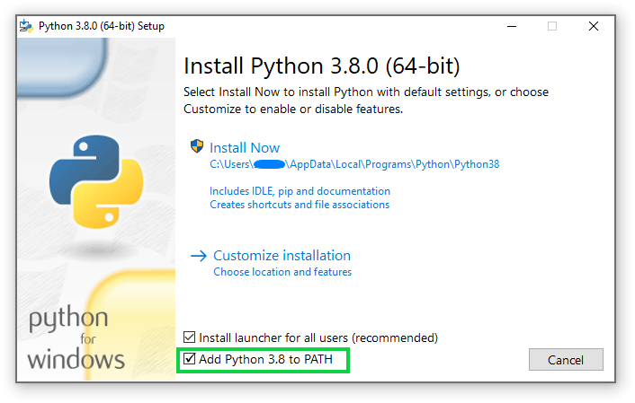
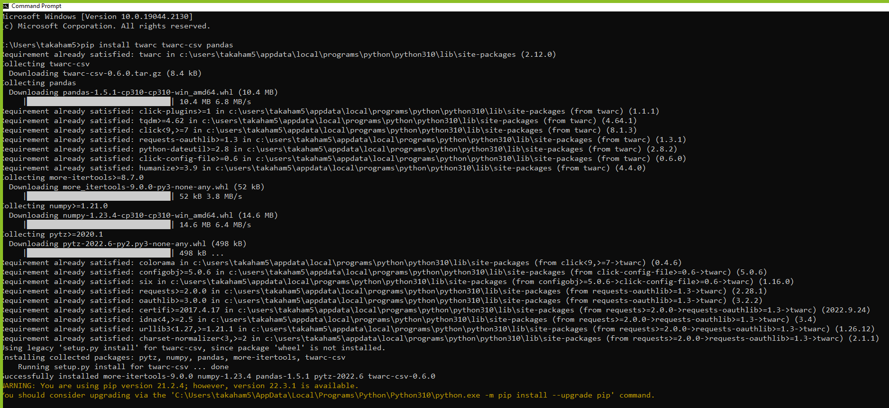
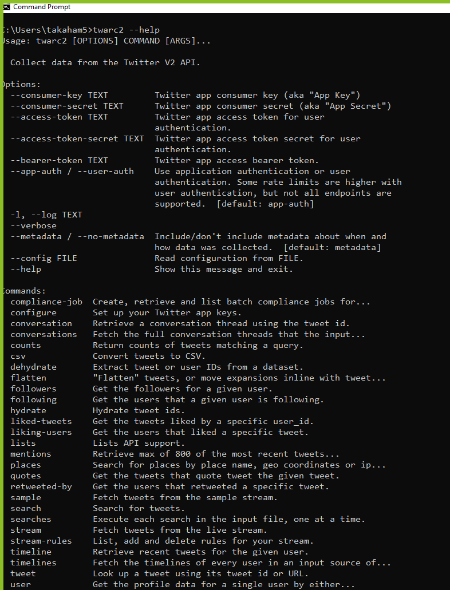
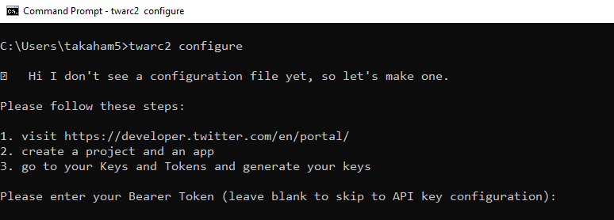
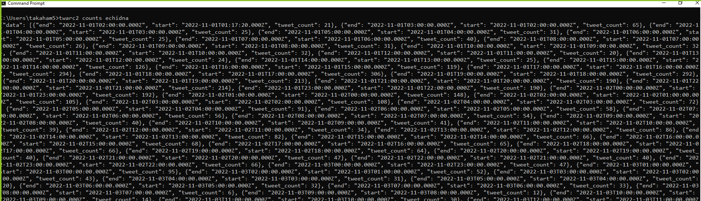
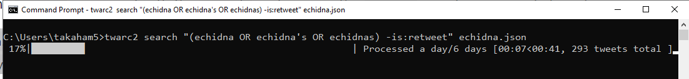
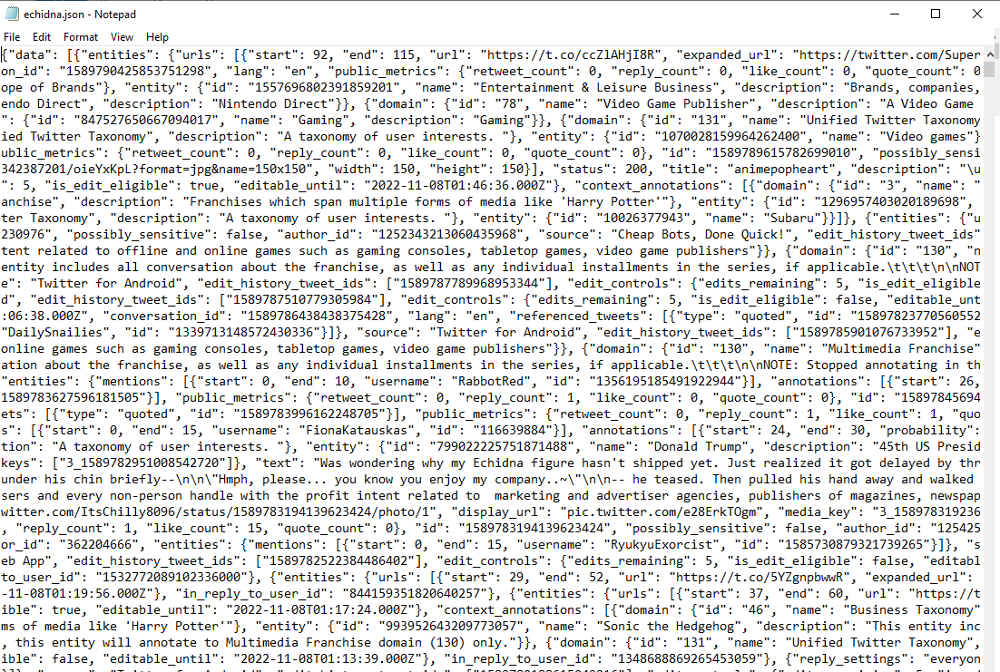
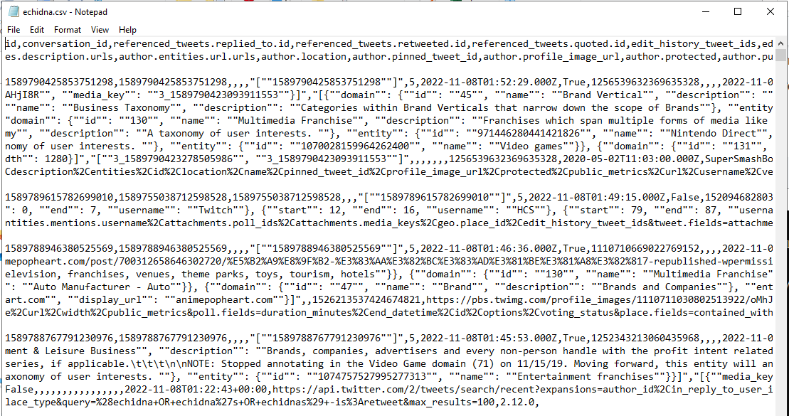
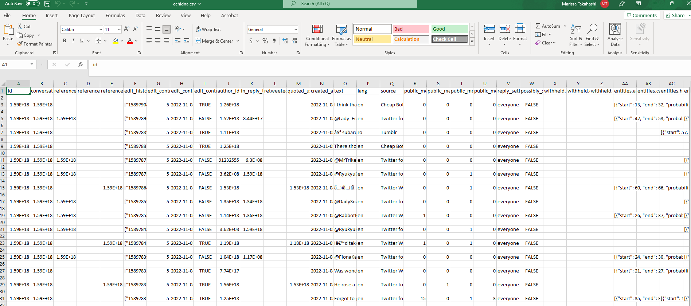

# Twarc Tutorial

Twarc is a command line tool for collecting Twitter data via Twitter's web Application Programming Interface (API). This tutorial is aimed at researchers who are new to collecting social media data, and who might be unfamiliar with command line interfaces.

By the end of this tutorial, you will have:

1. Familiarised yourself with interacting with a command line application via a terminal
2. Setup Twarc so you can collect data from the Twitter API (version 2)
3. Constructed two Twitter search queries to address a specific research question
4. Collected data for those two queries
5. Processed the collected data into formats suitable for other analysis
6. Performed a simple quantitative comparison of the two collections using Python
7. Prepared a dataset of tweet identifiers that can be shared with other researchers


## Motivating example

This tutorial is built around collecting data from Twitter to address the following research question:

***Which monotreme is currently the coolest - the echidna or the platypus?***

We'll answer this question with a simple quantitative approach to analysing the collected data: counting the volume of likes that tweets mentioning each species of animal accrue. For this tutorial, the species that gets the most likes on tweets is going to be considered the "coolest". This is a very simplistic quantitative approach, just to get you started on collecting and analysing Twitter data. To seriously study the relative coolness of monotremes, there are a wide variety of more appropriate (but also more involved) methods.

## Introduction to twarc and the Twitter API

### What is an API?

An **Application Programming Interface** (API) is a common method for software applications and services to allow other systems or people to programmatically interact with them. For example, Twitter has an API which allows external systems to make requests to Twitter for information or actions. Twitter (and many other web apps and services) uses an HTTP REST API, meaning that to interact with Twitter through the API you can send an HTTP request to a specific URL provided by Twitter. Twitter affords many different URLs (also known as **endpoints**) which have been designed for different purposes (more about that later). Assuming that your HTTP request is valid, Twitter will respond with a bundle of information in [JSON format](https://en.wikipedia.org/wiki/JSON) for you.

Twarc acts as a tool or an intermediary for you to interact with the Twitter API, so that you don't have to manage the details of how exactly to make requests to the Twitter API and handle Twitter's responses. Twarc commands correspond roughly with Twitter API endpoints. For example, when you use Twarc to fetch the timeline of a specific Twitter account (we'll use @Twitter in this example), this is the sequence of events:

1. You run `twarc2 timeline Twitter tweets.jsonl`

2. twarc2 makes a request on your behalf to the [Twitter v2 user lookup API endpoint](https://developer.twitter.com/en/docs/twitter-api/users/lookup/introduction) in order to find the user ID for the @Twitter account, and receives a response from the Twitter API server with that user ID

3. twarc2 makes a request on your behalf to the [Twitter v2 timeline API endpoint](https://developer.twitter.com/en/docs/twitter-api/tweets/timelines/introduction), using the user ID determined in step 2, and receives a response (or several responses) from the Twitter API server with @Twitter's tweets

4. twarc2 consolidates the timeline responses from step 3 and outputs them according to your initial command, in this case as `tweets.jsonl`

There are a great many resources on the internet to learn more about APIs more generally and how to use them in a variety of contexts. Here are a few introductory articles:

- [How to Geek: What is an API, and how do developers use them?](https://www.howtogeek.com/343877/what-is-an-api/)
- [IBM: What is an API?](https://www.ibm.com/cloud/learn/api)

More detailed information on APIs and working with them:

- [Zapier: An introduction to APIs](https://zapier.com/learn/apis/)
- [RealPython: Python and REST APIs: Interacting with web services](https://realpython.com/api-integration-in-python/)

### What can you do with the Twitter API?

The Twitter API is very popular in academic communities for good reason: it is one of the most accessible and research-friendly of the popular social media platforms at present. The Twitter API is well-established and offers a broad range of possibilities for data collection.

Here are some examples of things you can do with the Twitter API:

- Find historical tweets containing words or phrases during a time window of interest
- Collect live tweets as they are posted matching specific search criteria
- Collect tweets using specific hashtags or mentioning particular users
- Collect tweets made by a particular user account
- Collect engagement metrics including likes and retweets for specific tweets of interest
- Map Twitter account followers and followees within or around a group of users
- Trace conversations and interactions around users or tweets of interest

You may notice as you read about the Twitter API that there are two versions of the Twitter API - version 1.1 and version 2. At the time of writing, Twitter is providing both versions of the API, but at some unknown point in the future version 1.1 may be discontinued. Twarc can handle either API version: the `twarc` command uses version 1.1 of the Twitter API, the `twarc2` command uses version 2. Take care when reading documentation and tutorials as to which Twitter API version is being referenced. **This tutorial uses version 2 of the Twitter API**.

Twitter API endpoints can be structured either around tweets or around user accounts. For example, the search endpoint provides lists of tweets - user information is included, but the data is focused on the tweets.

The available endpoints and their details are evolving as Twitter develops and releases its API version 2, so for the most up to date information refer to [the Twitter API documentation](https://developer.twitter.com/en/docs/twitter-api). Some of the most used endpoints for research purposes are:

- [search](https://developer.twitter.com/en/docs/twitter-api/tweets/search/introduction): This is the endpoint used to search tweets, whether recent or historical.
- [lookup](https://developer.twitter.com/en/docs/twitter-api/tweets/lookup/introduction): The lookup endpoints are useful when you have IDs of tweets of interest and want to fetch further data about those tweets - known in the Twarc community as **hydrating** the tweets.
- [follows](https://developer.twitter.com/en/docs/twitter-api/users/follows/introduction): The follows endpoint allows collecting information about who follows who on Twitter.

With the Twitter API, you can get data related to all types of objects that make up the Twitter experience, including [tweets](https://developer.twitter.com/en/docs/twitter-api/data-dictionary/object-model/tweet) and [users](https://developer.twitter.com/en/docs/twitter-api/data-dictionary/object-model/user). The Twitter documentation provides full details, and these two pages are very useful to bookmark!

The Twitter documentation also provides some useful tools for constructing searches and queries:

- [Twitter's v2 API Query Builder](https://developer.twitter.com/apitools/query?query=)
- [Building high quality filters for getting Twitter data](https://developer.twitter.com/en/docs/tutorials/building-high-quality-filters)

The rest of this tutorial is going to focus on using the Twitter search API endpoint to retrieve tweets containing content relevant to the research question. We've chosen to focus on this because:

1. With the rich functionality available in the search API the data collection for many projects can be condensed down to a few carefully chosen searches.
2. With [academic research access](https://developer.twitter.com/en/products/twitter-api/academic-research) it's possible to search the entire Twitter archive, making search uniquely powerful among the endpoints Twitter supports.

### Introduction to twarc

Twarc is at its core an application for interacting with the Twitter API, reading results from the different functionality the API offers, and safely writing the collected data to your machine for further analysis. Twarc handles the mechanical details of interacting with the Twitter API like including information to authenticate yourself, making HTTP requests to the API, formatting data in the right way, and retrying when things on the internet fail. Your job is to work out:

1. Which endpoint you want to call on from the Twitter API.
2. Which data you want to retrieve from that endpoint.

Twarc is a command line based application - to use twarc you type a command specifying a particular action, and the results of that command are shown as text on screen. If you haven't used a command line interface before, don't worry! Although there is a bit of a learning curve at the beginning, you will quickly get the hang of it - and because everything is a typed command, it is very easy to record and share _exactly_ how you collected data with other people.


## Considerations when using social media data for research

Before we dive into the details, it's worth mentioning some broader issues you will need to keep in mind when working with social media data. This is by no means an exhaustive list of issues and is intended as a starting point for further enquiry.

### Ethical use of "public" communication

Even though most tweets on Twitter are public, in that they're accessible to anyone on the web, most users of Twitter don't have any expectation that researchers will be reading their tweets for the purpose of research. Researchers need to be mindful of this when working with data from Twitter, and user expectations should be considered as part of the study design. The Association of Internet Researchers has established [Ethical Guidelines for Internet Research](https://aoir.org/ethics/) which are a good starting point for the higher level considerations.

Work has also been done specifically looking at [Twitter users' expectations](https://journals.sagepub.com/doi/10.1177/2056305118763366), with a number of key concerns outlined. For this tutorial we're going to be taking a high level quantitative evaluation of very recent Twitter data, which distances ourselves from the specific tweets and users creating them and aligns with these broader ethical considerations.

Finally, because tweets (and the internet more generally) are searchable, we need to keep in mind that quoting a tweet in whole or part might allow easy reidentification of any specific user or tweet. For this reason care needs to be taken when reporting material from tweets, and common practices in qualitative research may not align with Twitter users' interests or expectations.

### Copyright

This may vary according to where you are in the world but tweets, including the text of the tweet and attached photos and videos are likely to be protected by copyright. As well as the Twitter Developer Agreement considerations in the next section, this may limit what you can do with tweets and media downloaded from Twitter.


### Twitter's terms of service

When you signed up for a Twitter developer account you agreed to follow Twitter's [Developer Agreement and Policy](https://developer.twitter.com/en/developer-terms/agreement-and-policy). This agreement constrains how you can use and share Twitter data. While the primary purpose of this agreement is to protect Twitter the company, this policy also incorporates some elements aimed at protecting users of Twitter.

Some particular things to note from the Developer Agreement are:

- Limits on how geolocation data can be used
- How to share Twitter data
- Dealing with deleted tweets

Note that researchers using deleted tweets were also key concerns for [Twitter users](https://journals.sagepub.com/doi/10.1177/2056305118763366). This tutorial won't cover geolocation data at all, but will cover approaches to sharing Twitter data and removing deleted material from collections.


## Setup

Twarc is a command line application, written in the Python programming language. To get Twarc running on our machines, we're going to need to install Python, then install Twarc itself, and we will also need to setup a Twitter developer account.

### Twitter developer access

[Start here](https://developer.twitter.com/en/apply-for-access) to apply for a Twitter developer account and follow the steps in [our developer access guide](twitter-developer-access.md). For this tutorial, you can skip step 2, as we won't require academic access.

Once you have the **Bearer Token**, you are ready for the next step. This token is like a password, so you shouldn't share it with other people. You will also need to be able to enter this token once to configure Twarc, so it would be best to copy and paste it to a text file on your local machine until we've finished configuration.

### Install Python

#### Windows

Install the latest version [for Windows](https://www.python.org/downloads/windows/). During the installation, make sure the *Add Python to PATH* option is selected/ticked.



#### Mac

Install the latest version [for Mac](https://www.python.org/downloads/macos/). No additional setup should be necessary for Python.


### Install Twarc and other utilities

For this tutorial we're going to install three Python packages, `twarc`, an extension called `twarc-csv`, and `pandas`, a Python library for data analysis. We will use a command line interface to install these packages. On Windows we will use the `cmd` console, which can be found by searching for `cmd` from the start menu - you should see a prompt like the below screenshot. On Mac you can open the `Terminal` app.


Once you have a terminal open we can run the following command to install the necessary packages:

```shell
pip install twarc twarc-csv pandas
```

You should see output similar to the following:



### Our first command: making sure everything is working

Let's open a terminal and get started - just like when installing twarc, you will want to use the `cmd` application on windows and the `Terminal` application on Mac.

The first command we want to run is to check if everything in twarc is installed and working correctly. We'll use twarc's builtin `help` for this. Running the following command should show you a brief overview of the functionality that the twarc2 command provides and some of the options available:

```shell
twarc2 --help
```



Twarc is structured like many other command line applications: there is a single main command, `twarc2`, to launch the application, and then you provide a subcommand, or additional arguments, or flags to provide additional context about what that command should actually do. In this case we're only launching the `twarc2` command, and providing a single _flag_ `--help` (the double-dash syntax is usually used for this). Most terminal applications will have a `--help` or `-h` flag that will provide some useful information about the application you're running. This often includes example usage, options, and a short description.

Note also that often when reading commands out loud, the space in between words is not mentioned explicitly: the command above (`twarc2 --help`) might be read as "twarc-two dash dash help".

Though we won't cover the command line outside of using Twarc in this tutorial, your operating system's command line functionality is extensive and can help you automate a lot of otherwise tedious tasks. If you're interested in learning more the [Software Carpentry lesson on the shell](https://swcarpentry.github.io/shell-novice/) is a good starting point.


### Configuring twarc with our bearer token

The next thing we want to do is tell twarc about our bearer token so we can authenticate ourselves with the Twitter API. This can be done using twarc's `configure` command. In this case we're going to use the `twarc2` main command, and provide it with the subcommand `configure` to tell twarc we want to start the configuration process.

```
twarc2 configure
```

On running this command twarc will prompt us to paste our bearer token, as shown in the screenshot below. Note that for many command line terminals on Windows, using the usual `Ctrl+V` keyboard shortcut will not work by default. If this happens, try right-clicking,then click `paste` to achieve the same thing. After entering our token, we will be prompted to enter additional information - this is not necessary for this tutorial, so we will skip this step by typing the letter `n` and hitting `enter`.




## Introduction to Twitter search and counts

To tackle the research question we're interested in we're going to use the search endpoint to retrieve two sets of tweets: those using the word echidna, and those using the word platypus.

There are two key commands that the Twitter API provides for search: a `search` endpoint to retrieve tweets matching a particular query, and a `counts` endpoint to tell you how many tweets match that query over time. It's always a good idea to start with the `counts` endpoint first, because:

- it lets you establish early on how many tweets you will need to deal with: too many or too few matching tweets will help you determine whether your search strategy is reasonable
- it can take a long time to retrieve large numbers of tweets and its better to know in advance how much data you will need to deal with
- the count and trend over time is useful in and of itself
- if you accidentally search for the wrong thing you can consume your monthly quota of tweets without collecting anything useful

Let's get started with the `counts` API - in twarc this is accessible by the command `counts`. As before `twarc2` is our entry command, `counts` is the subcommand we're interested in, and the `echidna` is what we're interested in searching for on Twitter (the query).

```shell
twarc2 counts echidna
```

You should see something like the below screenshot - and yes, this output isn't very readable! By default twarc shows us the response in the JSON format directly from the Twitter API, so it's not great for using directly on the command line.



Let's improve this by updating our command to:

```shell
twarc2 counts echidna --text --granularity day
```

And we should see output like below (your results will be different, because you're searching on a different day to when these screenshots were captured). Note that the `--text` and `--granularity` are optional flags provided to the `twarc2 counts` command, we can see other options by running `twarc2 counts --help`. In this case `--text` returns a simplified text output for easier reading, and `--granularity day` is passed to the Twitter API to specify that we're interested only in daily counts of tweets, not the default hourly count.

```shell
2022-11-03T02:49:02.000Z - 2022-11-04T00:00:00.000Z: 974
2022-11-04T00:00:00.000Z - 2022-11-05T00:00:00.000Z: 802
2022-11-05T00:00:00.000Z - 2022-11-06T00:00:00.000Z: 527
2022-11-06T00:00:00.000Z - 2022-11-07T00:00:00.000Z: 554
2022-11-07T00:00:00.000Z - 2022-11-08T00:00:00.000Z: 883
2022-11-08T00:00:00.000Z - 2022-11-09T00:00:00.000Z: 723
2022-11-09T00:00:00.000Z - 2022-11-10T00:00:00.000Z: 1,567
2022-11-10T00:00:00.000Z - 2022-11-10T02:49:02.000Z: 219
```

Note that this is only the count for the last seven days, which is the level of search functionality available for all developers via the standard track of the Twitter API. If you have access to the [Twitter Academic track](https://developer.twitter.com/en/use-cases/do-research/academic-research), you can switch to searching the full Twitter archive from the `counts` and `search` commands by adding the `--archive` flag.

Twitter search is powerful and provides many rich options. However, it also functions a little differently to most other search engines, because Twitter search does not focus on _ranking_ tweets by relevance (like a web search engine does). Instead, Twitter search via the API focuses on retrieving all matching tweets in chronological order. In other words, Twitter search uses the [Boolean model of searching](https://nlp.stanford.edu/IR-book/html/htmledition/boolean-retrieval-1.html), and returns the documents that match exactly what you provide and nothing else.

Let's work through this example a little further, first we want to expand to capture more variants of the word echidna - note that Twitter search via the API matches on the whole word, so `echidna` and `echidnas` are different. You can also see that we've added some double quotes around our query - without these quotes the individual pieces of our query might be interpreted as additional arguments to our search command:

```shell
twarc2 counts "echidna echidna's echidnas" --granularity day --text
```

```console
2022-11-03T03:40:44.000Z - 2022-11-04T00:00:00.000Z: 0
2022-11-04T00:00:00.000Z - 2022-11-05T00:00:00.000Z: 0
2022-11-05T00:00:00.000Z - 2022-11-06T00:00:00.000Z: 0
2022-11-06T00:00:00.000Z - 2022-11-07T00:00:00.000Z: 0
2022-11-07T00:00:00.000Z - 2022-11-08T00:00:00.000Z: 0
2022-11-08T00:00:00.000Z - 2022-11-09T00:00:00.000Z: 0
2022-11-09T00:00:00.000Z - 2022-11-10T00:00:00.000Z: 0
2022-11-10T00:00:00.000Z - 2022-11-10T03:40:44.000Z: 0
```

Suddenly we're retrieving very few results! By default, if you don't specify an operator, the Twitter API assumes you mean AND, or that all of the words should be present - we will need to explicitly say that we want any of these words using the OR operator:

```shell
twarc2 counts "echidna OR echidna's OR echidnas" --granularity day --text
```

```console
2022-11-03T03:42:10.000Z - 2022-11-04T00:00:00.000Z: 964
2022-11-04T00:00:00.000Z - 2022-11-05T00:00:00.000Z: 846
2022-11-05T00:00:00.000Z - 2022-11-06T00:00:00.000Z: 552
2022-11-06T00:00:00.000Z - 2022-11-07T00:00:00.000Z: 573
2022-11-07T00:00:00.000Z - 2022-11-08T00:00:00.000Z: 962
2022-11-08T00:00:00.000Z - 2022-11-09T00:00:00.000Z: 758
2022-11-09T00:00:00.000Z - 2022-11-10T00:00:00.000Z: 1,591
2022-11-10T00:00:00.000Z - 2022-11-10T03:42:10.000Z: 288
```

We can also apply operators based on other content or properties of tweets (see more [search operators](https://developer.twitter.com/en/docs/twitter-api/tweets/search/integrate/build-a-query#list) in the Twitter API documentation). Because we're deciding to focus on the number of likes on tweets as our measure of coolness, we want to exclude retweets. If we don't exclude retweets, our like measure might be heavily influenced by one highly retweeted tweet.

We can do this using the `-` (minus) operator, which allows us to exclude tweets matching a criteria, in conjunction with the `is:retweet` operator, which filters on whether the tweet is a retweet or not. If we applied just the `is:retweet` operator we'd only see the retweets, the opposite of what we want.

```shell
twarc2 counts "echidna OR echidna's OR echidnas -is:retweet" --granularity day --text
```

```text
2022-11-03T03:43:02.000Z - 2022-11-04T00:00:00.000Z: 957
2022-11-04T00:00:00.000Z - 2022-11-05T00:00:00.000Z: 826
2022-11-05T00:00:00.000Z - 2022-11-06T00:00:00.000Z: 546
2022-11-06T00:00:00.000Z - 2022-11-07T00:00:00.000Z: 570
2022-11-07T00:00:00.000Z - 2022-11-08T00:00:00.000Z: 931
2022-11-08T00:00:00.000Z - 2022-11-09T00:00:00.000Z: 750
2022-11-09T00:00:00.000Z - 2022-11-10T00:00:00.000Z: 1,587
2022-11-10T00:00:00.000Z - 2022-11-10T03:43:02.000Z: 288
```

There's one tiny gotcha from the Twitter API here, which is important to know about. AND operators are applied before OR operators, even if the AND is not specified by the user. The query we wrote above actually means something like below. We're only removing the retweets containing the word "echidnas", not all retweets:

```
echidna OR echidna's OR (echidnas AND -is:retweet)
```

We can make our intent explicit by adding parentheses to group terms. This is a good idea in general to make your meaning clear, even if you know all of the operator rules.

```shell
twarc2 counts "(echidna OR echidna's OR echidnas) -is:retweet" --granularity day --text
```

Now for the purposes of this tutorial we're going to stop exploring any further, but we could continue to refine and improve this query to match our research question. Twitter lets you build very long queries (up to 512 characters on the standard track and 1024 for the academic track) so you have plenty of scope to express yourself. As mentioned earlier, [Twitter's Query Builder](https://developer.twitter.com/apitools/query?query=) is an excellent tool for helping you to build your query.

If we apply the same kind of process to the platypus case, we might end up with something like the following. In this case it was necessary to use the [Twitter search web interface](https://twitter.com/explore) to find some of the variations in the word platypus:

```shell
twarc2 counts "(platypus OR platpus's OR platypi OR platypusses OR platypuses) -is:retweet" --granularity day --text
```

Having decided on the actual queries to run and examined the counts, now it's time to actually collect the tweets! We can take the queries we ran earlier, replace the `counts` command with the `search` and remove the `counts` specific arguments to get:

```shell
twarc2 search "(echidna OR echidna's OR echidnas) -is:retweet" echidna.json

twarc2 search "(platypus OR platpus's OR platypi OR platypusses OR platypuses) -is:retweet" platypus.json
```

Running these two commands will save the tweets matching each of those searches to two files on our disk, which we will use for the next sessions.



TIP: if you're not sure where the files above have been saved, you can run the command `cd` on Windows, or `pwd` on Mac to have your shell print out the folder in the filesystem where twarc has been working.

## Understanding and transforming twitter JSON data

Now that we've collected some data, it's time to take a look at it. Let's start by viewing the collected data in its plainest form: as a text file. Although we named the file with an extension of `.json`, this is just a convention: the actual file content is a plain text in the [JSON](https://en.wikipedia.org/wiki/JSON) format. Let's open this file with our inbuilt text editor (Notepad on Windows, TextEdit on Mac).



You'll notice immediately that there is a *lot* of data in that file: tweets are rich objects, and we mentioned that twarc by default captures as much information as Twitter makes available. Further, the Twitter API provides data in a format that makes it convenient for machines to work with, but not so much for humans.

## Making a CSV file from our collected tweets

We don't recommend trying to manually parse this raw data unless you have specific needs that aren't covered by existing tools. So we're going to use the `twarc-csv` package that we installed earlier to do the heavy lifting of transforming the collected JSON into a more friendly comma-separated value ([CSV](https://en.wikipedia.org/wiki/Comma-separated_values)) file. CSV is a simple plaintext format, but unlike JSON format is easy to import or open with a spreadsheet.

The `twarc-csv` package lets us use a `csv` command to transform the files from twarc:

```shell
twarc2 csv echidna.json echidna.csv

twarc2 csv platypus.json platypus.csv
```

If we look at these files in our text editor again, we'll see a nice structure of one line per tweet, with all of the many columns for that tweet.



Since we're going to do more analysis with the Pandas library to answer our question, we will want to create the CSV with only the columns of interest. This will reduce the time and amount of computer memory/RAM you need to load your dataset. For example, the following commands produce CSV files with a small number of fields:

```shell
twarc2 csv --output-columns id,created_at,author_id,text,referenced_tweets.retweeted.id,public_metrics.like_count echidna.json echidna_minimal.csv

twarc2 csv --output-columns id,created_at,author_id,text,referenced_tweets.retweeted.id,public_metrics.like_count platypus.json platypus_minimal.csv
```

### The problem with Excel

It's tempting to try to open these CSV files directly in Excel, but if you do you're probably going to notice one or more of the following problems, as illustrated below:

1. The ID columns are likely to be broken.
2. Emoji and languages that don't use latin characters may not appear correctly.
3. Tweets may be broken up on newlines.
4. Excel can only support 1,048,576 rows - it's very easy to collect tweet datasets bigger than this.



If you save a file from Excel with any of those problems that file is no longer useful for most purposes (this is a common and longstanding problem with using spreadsheet software, that affects many fields. For example in genomics: https://www.nature.com/articles/d41586-021-02211-4). While it is possible to make Excel do the right thing with your data, it takes more work, and a single mistake can lead to loss of important data. Therefore our recommendation is, if possible, to avoid the use of spreadsheets for analysing Twitter data.

### Working with Pandas

If you are going to be using the scientific Python library [Pandas](https://pandas.pydata.org/) for any processing or analysis, you may wish to use Pandas methods. Pandas can be used to load and manipulate data like we have in our CSV file. Note that for this section we're going to run a very simple computation, the references will have links to more extensive resources for learning more.

```python
# process_monotremes.py

import pandas

echidna = pandas.read_csv("echidna_minimal.csv")
platypus = pandas.read_csv("platypus_minimal.csv")

echidna_likes = echidna["public_metrics.like_count"].sum()
platypus_likes = platypus["public_metrics.like_count"].sum()

print(f"Total likes on echidna tweets: {echidna_likes}. Total likes on platypus tweets: {platypus_likes}.")
```

Run this script through Python to see which of the monotremes is the coolest:

```shell
python process_monotremes.py
```

### Answering the research question: which monotreme is the coolest?

At the time of creating this tutorial, the above script run with the just collected data leads to the following result:

```shell
Total likes on echidna tweets: 1787652. Total likes on platypus tweets: 3462715.
```

On that basis, we can conclude that at the time of running this search the platypus is nearly twice as cool as the echnida based on Twitter likes.

Of course this is a simplistic approach to answering this specific research question - we could have made many other choices. Even using a simple quantitative approach looking at metrics: we could have chosen to look at other engagement counts like the number of retweets, or looked at the number of followers of the accounts tweeting about each animal (because a "cooler" account will have more followers). Much of the challenge in using Twitter for research is both about asking the right research question and also the choosing the right approach to the data to address that research question.

## Prepare a dataset for sharing/using a shared dataset

Having performed this analysis and come to a conclusion, it is good practice to share the underlying data so other people can reproduce these results (with some caveats). Noting that we want to preserve Twitter users' agency over the availability of their content, and Twitter's Developer Agreement, we can do this by creating a dataset of tweet IDs. Instead of sharing the content of the tweets, we can share the unique ID for that tweet, which allows others to `hydrate` the tweets by retrieving them again from the Twitter API.

This can be done as follows using twarc's `dehydrate` command:

```shell
twarc2 dehydrate --id-type tweets platypus.json platypus_ids.txt

twarc2 dehydrate --id-type tweets echidna.json echidna_ids.txt
```

These commands will produce the two text files, with each line in these files containing the unique ID of the tweet.

To `hydrate`, or retrieve the tweets again, we can use the corresponding commands:

```shell
twarc2 hydrate platypus_ids.txt platypus_hydrated.json

twarc2 hydrate echidna_ids.txt echidna_hydrated.json
```

Note that the hydrated files will include fewer tweets: tweets that have been deleted, or tweets by accounts that have been deleted, suspended, or protected, will not be included in the file. Note also that hydrating a dataset also means that engagement metrics like retweets and likes will be up to date for tweets that are still available.


## Suggested resources

You can find some additional links and resources in the [resources section](https://twarc-project.readthedocs.io/en/latest/resources/) of the twarc documentation.
